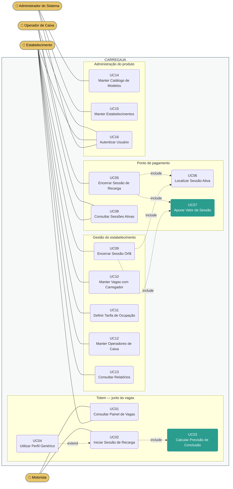
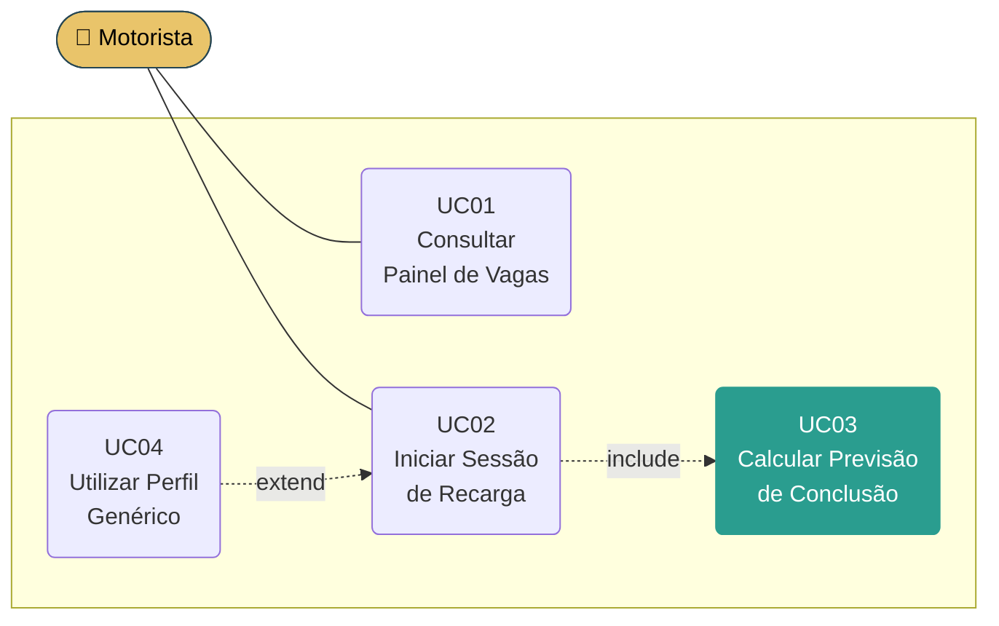
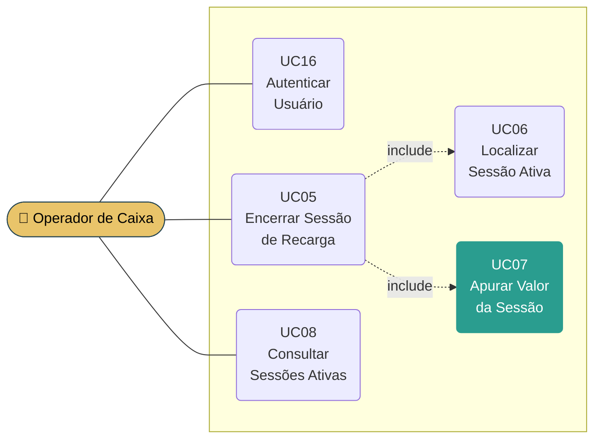
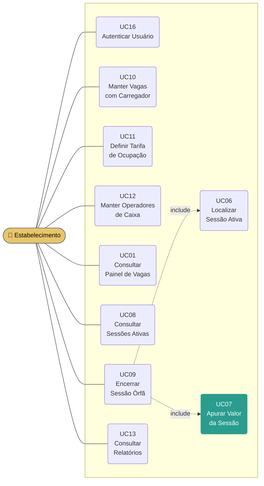
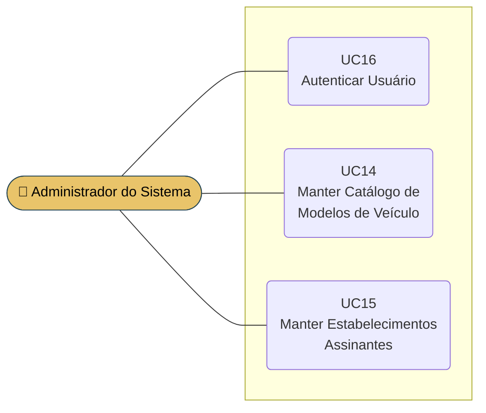

# Modelo de Caso de Uso

**CARREGAJA — Sistema de Gerenciamento de Recarga de Veículos Elétricos em Estacionamentos**

Versão 1.0

## Histórico de Revisões

| Data | Versão | Descrição | Autor |
|---|---|---|---|
| 19/08/2026 | 1.0 | Elaboração inicial. Quatro atores, dezesseis casos de uso, matriz de permissões. Derivado do documento Visão v1.1. | Henrique de Almeida Marangoni Inacio |

> **Situação deste artefato.** Os diagramas estão em **PlantUML** (`.puml`, fonte versionável)
> e em **Mermaid** (embutido neste documento). A transposição para o **Astah**, ferramenta
> indicada pelo processo SpinOff, está pendente — ver a seção *Pendências* ao final.

---

## 1. Atores

| Ator | Descrição | Autentica? |
|---|---|---|
| **Motorista** | Condutor de veículo elétrico e usuário final do sistema. Interage exclusivamente pelo totem instalado junto às vagas. Não possui cadastro nem credenciais; identifica-se pela placa do veículo e pelo código de sessão impresso no comprovante de início. | Não |
| **Operador de Caixa** | Funcionário que atende o ponto de pagamento do estabelecimento — caixa do restaurante, guichê do estacionamento, recepção do hotel. Encerra as sessões de recarga e obtém o valor para inclusão na conta do cliente. | Sim |
| **Estabelecimento** | Gestor do estacionamento do cliente contratante. Configura o mapa das vagas, a tarifa e os operadores de caixa, acompanha a operação e consulta os relatórios do seu próprio estabelecimento. | Sim |
| **Administrador do Sistema** | Responsável pela operação do CARREGAJA como produto, junto ao fornecedor do software. Único ator com alcance sobre todos os estabelecimentos assinantes. | Sim |

---

## 2. Visão geral



> Os dois casos de uso destacados em verde — **UC03** e **UC07** — concentram a regra de
> negócio do sistema. São eles que devem ser atacados primeiro na fase de Elaboração, como
> arquitetura executável, conforme o risco RI-10 do documento Visão.

---

## 3. Casos de uso por ator

### 3.1. Motorista



### 3.2. Operador de Caixa



### 3.3. Estabelecimento



### 3.4. Administrador do Sistema



---

## 4. Descrição dos casos de uso

As descrições abaixo são resumidas, conforme a boa prática indicada na tarefa *Definir o Escopo
do Sistema* do SpinOff. O detalhamento completo, com fluxos principal e alternativos, é
produzido na tarefa *Detalhar Requisitos*, na fase de Elaboração.

### UC01 — Consultar Painel de Vagas

Exibe a situação de todas as vagas com carregador do estabelecimento: quais estão livres, quais
estão ocupadas e, para as ocupadas, a previsão de conclusão da recarga.

No totem é a tela inicial e não exige identificação. Para o Estabelecimento, a mesma informação
é apresentada acrescida da identificação da sessão (vaga, placa e código) e da sinalização das
sessões cuja recarga já concluiu e das que ultrapassaram o limite máximo de duração.

### UC02 — Iniciar Sessão de Recarga

O Motorista informa, no totem, a vaga que ocupou, o modelo do veículo, o nível atual da bateria
e a placa. O sistema valida que a vaga existe, pertence ao estabelecimento e está livre;
calcula a previsão de conclusão (UC03); registra a sessão com data e hora de início; gera o
código de sessão; e emite o comprovante de início. A vaga passa a constar como ocupada no
painel.

### UC03 — Calcular Previsão de Conclusão

Determina o horário previsto de conclusão da recarga a partir de:

```
potência efetiva  = min(potência do carregador da vaga, potência máxima do modelo)
energia a repor   = capacidade da bateria × (100% − nível informado)
tempo estimado    = energia a repor ÷ potência efetiva
```

A regra da **potência efetiva** é a razão de o catálogo de modelos existir: um carregador de
22 kW não recarrega mais rápido um veículo que aceita no máximo 6,6 kW.

### UC04 — Utilizar Perfil Genérico de Veículo

*Estende UC02.* Acionado quando o modelo informado pelo Motorista não consta do catálogo. O
sistema oferece os perfis genéricos por porte de veículo. A previsão calculada a partir de
perfil genérico é identificada como **aproximada** no comprovante e no painel.

### UC05 — Encerrar Sessão de Recarga

No ponto de pagamento, o Operador de Caixa localiza a sessão ativa (UC06), encerra-a e obtém o
valor apurado (UC07) para inclusão na conta do cliente. O sistema registra a data e hora de
encerramento e o operador responsável, emite o comprovante de encerramento e libera a vaga no
painel.

**É o único ponto de encerramento de sessão do sistema.** O totem não encerra sessões — ver a
restrição RE-07 do documento Visão.

### UC06 — Localizar Sessão Ativa

Recupera uma sessão em andamento a partir do código de sessão ou da placa do veículo,
apresentando a vaga, o horário de início, o tempo decorrido e o valor apurado até o momento.

### UC07 — Apurar Valor da Sessão

Calcula o valor devido:

```
valor = tempo de ocupação × tarifa por hora vigente no início da sessão
```

A tarifa considerada é a **vigente no momento do início** da sessão, e não a atual, para que
uma alteração de tarifa durante a ocupação não altere o valor já em curso.

### UC08 — Consultar Sessões Ativas

Lista as sessões em andamento do estabelecimento, com vaga, placa, horário de início, tempo
decorrido, previsão de conclusão e valor apurado até o momento. Permite ao Operador de Caixa
conferir as sessões antes do fechamento do período — mitigação do risco RI-03 — e ao
Estabelecimento acompanhar a operação.

### UC09 — Encerrar Sessão Órfã

Permite ao Estabelecimento encerrar administrativamente uma sessão que permaneceu aberta além
do limite máximo de duração, liberando a vaga. O encerramento registra a justificativa e o
responsável, e o valor apurado é destacado como **não cobrado no ponto de pagamento**.
Mitigação do risco RI-05.

### UC10 — Manter Vagas com Carregador

Cadastro, alteração e desativação das vagas equipadas com carregador do estabelecimento,
contendo o código de identificação da vaga, sua localização no estacionamento e a **potência do
carregador** instalado — dado de entrada do cálculo do UC03.

### UC11 — Definir Tarifa de Ocupação

Registra o valor por hora de ocupação cobrado pelo estabelecimento, com a data a partir da qual
passa a vigorar. As tarifas anteriores são preservadas, para permitir a apuração de sessões
passadas e a conferência de relatórios históricos.

### UC12 — Manter Operadores de Caixa

Cadastro, alteração e desativação dos usuários com perfil Operador de Caixa do estabelecimento.
Justifica-se por ser função de alta rotatividade, cuja gestão precisa ser autônoma e imediata.

### UC13 — Consultar Relatórios de Utilização e Receita

Apresenta, por período e por vaga: número de sessões, tempo total de ocupação, taxa de ocupação
e receita apurada. Atende à necessidade de avaliar o retorno do investimento em pontos de
recarga.

### UC14 — Manter Catálogo de Modelos de Veículo

Cadastro, alteração e desativação dos modelos de veículo elétrico, com **capacidade da bateria**
e **potência máxima de recarga**, e dos **perfis genéricos** por porte usados como alternativa
(UC04). O catálogo é único e compartilhado por todos os estabelecimentos assinantes.

### UC15 — Manter Estabelecimentos Assinantes

Cadastro, alteração e suspensão dos estabelecimentos clientes do sistema e do usuário gestor de
cada um.

### UC16 — Autenticar Usuário

Valida as credenciais dos usuários internos e estabelece o perfil de acesso da sessão. É
**pré-condição de todos os casos de uso** do Operador de Caixa, do Estabelecimento e do
Administrador do Sistema. O Motorista não se autentica.

---

## 5. Matriz de permissões de acesso

| # | Caso de uso | Motorista | Operador de Caixa | Estabelecimento | Administrador |
|---|---|:---:|:---:|:---:|:---:|
| UC01 | Consultar Painel de Vagas | ✔ | — | ✔ | — |
| UC02 | Iniciar Sessão de Recarga | ✔ | — | — | — |
| UC03 | Calcular Previsão de Conclusão | *incl.* | — | — | — |
| UC04 | Utilizar Perfil Genérico de Veículo | *ext.* | — | — | — |
| UC05 | Encerrar Sessão de Recarga | — | ✔ | — | — |
| UC06 | Localizar Sessão Ativa | — | *incl.* | *incl.* | — |
| UC07 | Apurar Valor da Sessão | — | *incl.* | *incl.* | — |
| UC08 | Consultar Sessões Ativas | — | ✔ | ✔ | — |
| UC09 | Encerrar Sessão Órfã | — | — | ✔ | — |
| UC10 | Manter Vagas com Carregador | — | — | ✔ | — |
| UC11 | Definir Tarifa de Ocupação | — | — | ✔ | — |
| UC12 | Manter Operadores de Caixa | — | — | ✔ | — |
| UC13 | Consultar Relatórios de Utilização e Receita | — | — | ✔ | — |
| UC14 | Manter Catálogo de Modelos de Veículo | — | — | — | ✔ |
| UC15 | Manter Estabelecimentos Assinantes | — | — | — | ✔ |
| UC16 | Autenticar Usuário | — | ✔ | ✔ | ✔ |

✔ ator executa · *incl.* executado por inclusão · *ext.* executado por extensão · — sem acesso

### Fronteiras que a matriz torna explícitas

| Fronteira | Por quê |
|---|---|
| O **Operador de Caixa** não acessa UC10 a UC13 | Não altera tarifa, não vê relatório financeiro e não modifica o mapa. É função de alta rotatividade, frequentemente terceirizada. |
| O **Estabelecimento** não acessa UC05 | Quem encerra no ponto de pagamento é o operador, e cada encerramento fica registrado com o responsável. O gestor encerra apenas sessões órfãs (UC09), com justificativa. |
| O **Estabelecimento** não acessa UC14 e UC15 | O catálogo de modelos é único e compartilhado; alterá-lo afetaria todos os assinantes. |
| O **Administrador** não acessa UC01 a UC13 | Opera o produto, não o estacionamento de um cliente. Não tem acesso aos dados operacionais nem financeiros dos assinantes. |
| O **Motorista** não se autentica | Uso anônimo por decisão de escopo — restrição RE-08 do documento Visão. |

---

## 6. Rastreabilidade com o documento Visão

Cada caso de uso responde a uma ou mais necessidades registradas na seção 2 do Visão.

| Necessidade (Visão §2) | Caso de uso |
|---|---|
| §2.1 Registrar cada uso das vagas com carregador | UC02, UC05 |
| §2.1 Consultar relatórios de utilização por período e por vaga | UC13 |
| §2.2 Ver quais vagas estão livres e ocupadas | UC01 |
| §2.2 Ver a previsão de liberação das vagas ocupadas | UC01, UC03 |
| §2.2 Saber quanto tempo a recarga levará | UC02, UC03 |
| §2.3 Cobrança proporcional ao tempo total de ocupação | UC07 |
| §2.3 Identificar vagas com recarga concluída ainda ocupadas | UC01, UC08 |
| §2.4 Obter o valor apurado ao encerrar a sessão | UC05, UC07 |
| §2.4 Definir a tarifa por hora de ocupação | UC11 |
| §2.5 Encerrar a sessão no próprio ponto de pagamento | UC05 |
| §2.5 Pagar a recarga junto com a conta do estabelecimento | UC05 |
| §2.6 Manter catálogo de modelos com capacidade e potência | UC14 |
| §2.6 Informar modelo e nível de bateria para o cálculo | UC02, UC03, UC04 |

Casos de uso sem necessidade correspondente no Visão — decorrem de restrições, riscos ou da
natureza multiempresa do produto:

| Caso de uso | Origem |
|---|---|
| UC09 Encerrar Sessão Órfã | Risco RI-05 |
| UC08 Consultar Sessões Ativas | Riscos RI-02, RI-03 |
| UC12 Manter Operadores de Caixa | Restrição RE-07 (existência do ponto de pagamento) |
| UC15 Manter Estabelecimentos Assinantes | Modelo de negócio por assinatura (Visão §1.1) |
| UC16 Autenticar Usuário | Separação de perfis de acesso |

---

## 7. Fora do escopo

Registrado para evitar ambiguidade na leitura do modelo. Todos decorrem de restrições do
documento Visão.

| Não é caso de uso deste sistema | Restrição |
|---|---|
| Acionar, bloquear ou medir o carregador | RE-05 |
| Processar pagamento | RE-06 |
| Encerrar sessão pelo totem | RE-07 |
| Cadastrar motorista | RE-08 |
| Cobrar por energia consumida | RE-09 |

---

## 8. Pendências

| Pendência | Impacto |
|---|---|
| **Transposição para o Astah.** O SpinOff indica o Astah para modelagem UML e fornece o `Template - Modelos Analise e Design.asta`. Os diagramas aqui estão em PlantUML e Mermaid. | O item 7 do Checklist de Projeto pergunta se o artefato foi criado com o template atual — só será plenamente atendido após a transposição. |
| **Aprovação do escopo pelo Product Owner.** | Item 11 do Checklist de Projeto. |
| **Protótipo das telas do totem.** Não iniciado. | Item 10 do Checklist de Projeto (condicional: *"caso tenha sido criado"*). |

---

## 9. Referências

| Documento | Local |
|---|---|
| CARREGAJA - Visão (v1.1) | `1.Requisitos/` |
| Diagrama geral em PlantUML | `2.Analise e Design/CARREGAJA - Modelo de Caso de Uso.puml` |
| Diagramas por ator em PlantUML | `2.Analise e Design/CARREGAJA - Modelo de Caso de Uso - por ator.puml` |
| Guia - Use Case e Histórias do Usuário | `.spinoff/guias/` |
| SpinOff — tarefa *Definir o Escopo do Sistema* | `.spinoff/METODO.md` |
