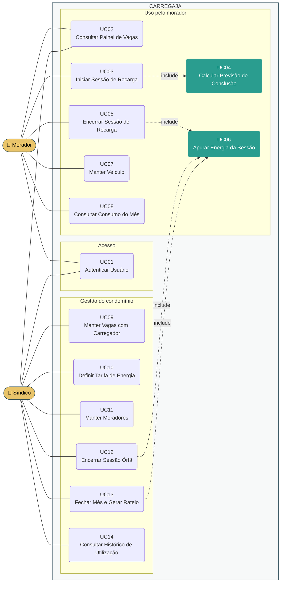
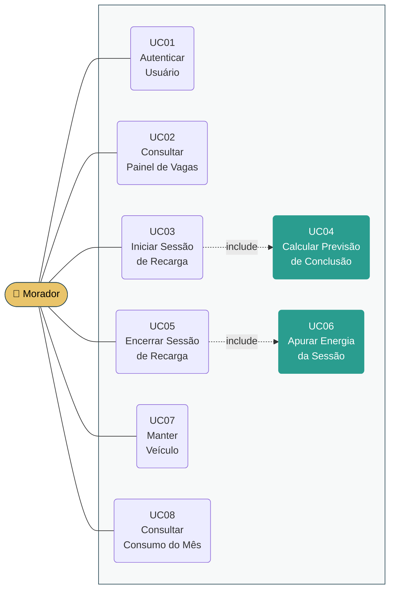
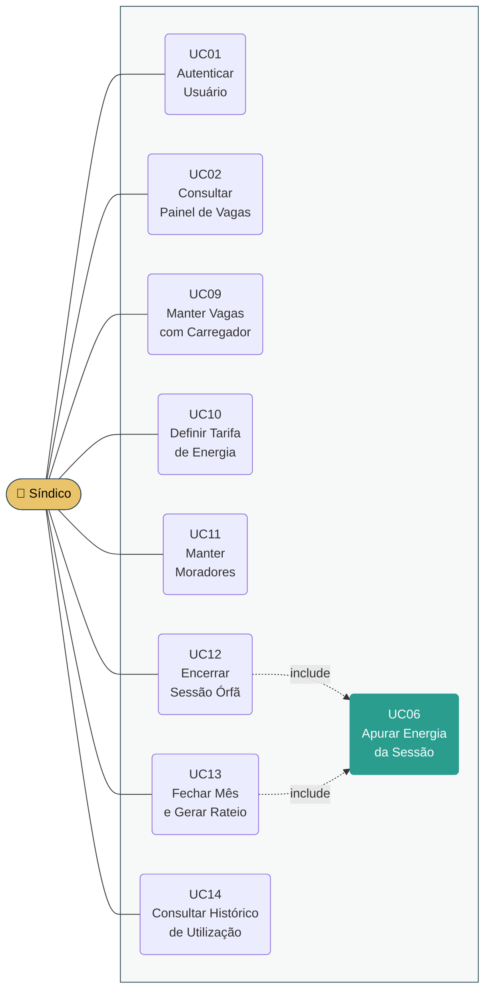

# Modelo de Caso de Uso

**CARREGAJA — Sistema de Controle e Rateio de Recarga de Veículos Elétricos em Condomínio**

Versão 3.0

## Histórico de Revisões

| Data | Versão | Descrição | Autor |
|---|---|---|---|
| 19/08/2026 | 1.0 | Elaboração inicial. Quatro atores, dezesseis casos de uso, matriz de permissões. Derivado do documento Visão v1.1. | Henrique de Almeida Marangoni Inacio |
| 27/08/2026 | 2.0 | **Reescrita integral por redução de escopo.** Dois atores mais o ator temporal, dezesseis casos de uso. Eliminados os perfis Estabelecimento, Operador de Caixa e Administrador do Sistema, o totem, o catálogo compartilhado de modelos e a gestão de assinantes. Incluídos o agendamento de vagas e o fechamento mensal com rateio. Derivado do documento Visão v2.0. | Henrique de Almeida Marangoni Inacio |
| 27/08/2026 | 3.0 | **Remoção do agendamento.** Removidos os casos de uso *Manter Agendamento* e *Expirar Reserva Não Utilizada*, e com este o ator **Tempo**, que não tinha outro caso de uso. Removido o estado *Reservada* do painel. Casos de uso **renumerados para UC01–UC14**, sem lacunas. Derivado do documento Visão v3.0. | Henrique de Almeida Marangoni Inacio |

> **Situação deste artefato.** Os diagramas estão em **PlantUML** (`.puml`, fonte versionável)
> e em **Mermaid** (embutido neste documento). A transposição para o **Astah**, ferramenta
> indicada pelo processo SpinOff, está pendente — ver a seção *Pendências* ao final.

---

## 1. Atores

| Ator | Descrição | Autentica? |
|---|---|---|
| **Morador** | Condômino ou residente autorizado, proprietário de veículo elétrico. Vinculado a um apartamento, que é a unidade de rateio. Interage pela aplicação web no celular, tanto do apartamento quanto da garagem. | Sim |
| **Síndico** | Responsável pela administração do condomínio, eleito em assembleia, ou preposto da administradora. Configura o sistema, trata exceções e fecha o mês. | Sim |

**O ator Tempo deixou de existir.** Na versão 2.0 havia um ator temporal, cujo único caso de uso
era expirar reservas não utilizadas. Removido o agendamento, não sobrou comportamento disparado
pela passagem do tempo: o estado *Excedida* do painel (UC02) é **derivado na consulta**, não um
evento que altera dados.

**Nota sobre a acumulação de perfis.** O síndico é também condômino e pode possuir veículo
elétrico. Nesse caso ele exerce os dois papéis, e suas recargas são apuradas e rateadas como as
dos demais. As ações de gestão ficam registradas com o usuário que as realizou.

---

## 2. Visão geral



> Os dois casos de uso destacados em verde — **UC04** e **UC06** — concentram a regra de
> negócio do sistema. São eles que devem ser atacados primeiro na fase de Elaboração, como
> arquitetura executável, conforme o risco RI-08 do documento Visão.

---

## 3. Casos de uso por ator

### 3.1. Morador



O morador é o usuário de maior volume do sistema. Seu ciclo se resolve em uma única ida à
garagem: ele **consulta o painel do apartamento** (UC02) para saber se vale a pena descer,
**desce e registra o início** (UC03) e, ao retirar o veículo, **encerra** (UC05).

### 3.2. Síndico



A carga de uso do síndico é concentrada: a configuração (UC09 a UC11) ocorre na implantação e
raramente muda; o fechamento (UC13) é mensal; o tratamento de exceções (UC12) é eventual.

---

## 4. Descrição dos casos de uso

As descrições abaixo são resumidas, conforme a boa prática indicada na tarefa *Definir o Escopo
do Sistema* do SpinOff. O detalhamento completo, com fluxos principal e alternativos, está no
artefato **CARREGAJA - História de Usuário**, em `1.Requisitos/Casos de Uso/`.

### UC01 — Autenticar Usuário

Identifica o usuário por credenciais e determina seu perfil — Morador, Síndico ou ambos. Todo
acesso ao sistema exige autenticação; não há uso anônimo (restrição RE-08 do documento Visão).
As credenciais são criadas pelo síndico ao cadastrar o morador (UC11).

### UC02 — Consultar Painel de Vagas

Exibe a situação de todas as vagas com carregador do condomínio, em um de quatro estados:

| Estado | Significado |
|---|---|
| **Livre** | Sem sessão ativa. A vaga pode ser ocupada por qualquer morador. |
| **Ocupada** | Há sessão de recarga em andamento. Exibe a previsão de conclusão. |
| **Concluída, ainda ocupada** | A previsão de conclusão já passou e a sessão não foi encerrada. Sinaliza vaga que provavelmente pode ser liberada. |
| **Excedida** | A sessão ultrapassou a duração máxima (RE-11 do documento Visão). A sessão **permanece aberta** — o sistema sinaliza, não encerra. |

Os estados **Concluída, ainda ocupada** e **Excedida** são derivados do tempo decorrido, não de
uma ação de usuário nem de um processo que altere dados: são calculados no momento da consulta.
Nenhum dos dois altera o estado da sessão — existem para informar. É essa a resposta possível ao
risco RI-04 do documento Visão, dado que o sistema não controla o carregador e, portanto, não
pode liberar a vaga por conta própria.

Para o morador, o painel não identifica quem está usando cada vaga — apenas o estado e a
previsão. Para o síndico, apresenta adicionalmente o apartamento e o morador de cada sessão, e
destaca as sessões candidatas a órfãs (UC12).

**Este caso de uso carrega sozinho a resposta ao problema da disponibilidade.** Removido o
agendamento, é a previsão de liberação exibida aqui que permite ao morador decidir quando
descer — ver seção 2.2 do documento Visão.

### UC03 — Iniciar Sessão de Recarga

Ao chegar à garagem e plugar o veículo, o morador registra o início informando a vaga que
ocupou e o nível atual da bateria. Os dados do veículo — modelo, capacidade e potência máxima —
vêm do cadastro (UC07) e não são declarados a cada uso.

O sistema valida que a vaga existe e está **livre**. Calcula a previsão de conclusão (UC04),
registra a sessão com data e hora de início e a potência efetiva apurada, e marca a vaga como
ocupada no painel, com a previsão visível aos demais moradores.

A sessão fica sujeita à **duração máxima** (RE-11) contada deste momento. Atingido o limite, ela
é sinalizada como excedida no painel (UC02), mas **não é encerrada**.

**Não há reserva prévia.** O uso é por ordem de chegada — restrição RE-12. Se dois moradores
descem ao ver a mesma vaga livre, o primeiro a registrar o início a ocupa, e o segundo recebe a
recusa com a previsão de liberação.

### UC04 — Calcular Previsão de Conclusão

Determina o horário previsto de conclusão da recarga a partir de:

```
potência efetiva  = min(potência do carregador da vaga, potência máxima do veículo)
energia a repor   = capacidade da bateria × (100% − nível informado)
tempo estimado    = energia a repor ÷ potência efetiva
```

A regra da **potência efetiva** é a razão de o cadastro de veículo existir: um carregador de
22 kW não recarrega mais rápido um veículo que aceita no máximo 6,6 kW.

Invocado uma única vez, no início da sessão (UC03), com duas finalidades simultâneas: informar
ao morador quando sua recarga termina, e alimentar o painel com a previsão de liberação que os
demais consultam.

### UC05 — Encerrar Sessão de Recarga

Ao retirar o veículo, o morador encerra a própria sessão. O sistema registra a data e hora de
encerramento, apura a energia da sessão (UC06), exibe ao morador a energia e o valor apurados —
permitindo contestação imediata, mitigação do risco RI-01 do documento Visão — e libera a vaga
no painel.

O morador encerra **apenas as próprias sessões**. O encerramento de sessão alheia cabe somente
ao síndico, pela via administrativa do UC12.

### UC06 — Apurar Energia da Sessão

Calcula a energia atribuída à sessão e o valor correspondente:

```
duração          = encerramento − início
energia estimada = min(potência efetiva × duração, energia a repor)
valor da sessão  = energia estimada × tarifa por kWh vigente no início
```

Duas decisões de cálculo merecem registro:

**O limite pela energia a repor.** A energia estimada nunca excede o que faltava na bateria no
início. Sem esse limite, um veículo esquecido plugado acumularia consumo indefinidamente, e uma
sessão órfã produziria valor arbitrariamente alto. Com ele, a apuração converge para a carga
efetivamente possível.

**A tarifa vigente no início.** Considera-se a tarifa do momento em que a sessão começou, e não
a atual, para que uma alteração de tarifa durante a ocupação não altere o valor de uma sessão
já em curso.

> **Consequência aceita.** Como a energia é limitada pela carga que faltava, permanecer na vaga
> após a conclusão da recarga **não gera custo adicional**. Removido o agendamento, o único
> instrumento de rotatividade deste sistema é a duração máxima e a sinalização no painel — ver
> o risco RI-04 do documento Visão.

### UC07 — Manter Veículo

O morador cadastra e mantém o próprio veículo: modelo, capacidade da bateria em kWh e potência
máxima de recarga em kW. O cadastro é feito **uma única vez** e reutilizado em toda sessão.

É esta decisão que dispensa o catálogo compartilhado de modelos da versão 1.0 deste modelo: com
poucas dezenas de moradores e um veículo por morador, manter um catálogo central custaria mais
do que o cadastro individual. O dado fica visível ao síndico, que pode conferi-lo contra o
documento do veículo — mitigação do risco RI-01.

### UC08 — Consultar Consumo do Mês

Apresenta ao morador suas sessões do período corrente, com data, vaga, duração, energia
estimada e valor, e o total acumulado que será lançado na sua cota condominial. Permite
consultar períodos anteriores já fechados.

Atende à necessidade de o morador **saber quanto será lançado antes de receber a cota** — seção
2.1 do documento Visão.

### UC09 — Manter Vagas com Carregador

O síndico cadastra e mantém as vagas com carregador da área comum: código de identificação da
vaga e potência do carregador em kW. A potência é insumo direto do cálculo de potência efetiva
(UC04).

Uma vaga não pode ser removida enquanto houver sessão em andamento sobre ela; pode ser
**desativada**, o que impede novas sessões sem apagar o histórico já apurado.

### UC10 — Definir Tarifa de Energia

O síndico define o valor por quilowatt-hora aplicado no rateio, a partir da conta de luz da área
comum. O sistema mantém o **histórico das tarifas com suas datas de vigência**, uma vez que a
apuração de cada sessão usa a tarifa vigente no seu início (UC06).

### UC11 — Manter Moradores

O síndico cadastra e mantém os moradores com acesso ao sistema, vinculando cada um ao seu
apartamento e criando suas credenciais de acesso (UC01). O vínculo com o apartamento é o que
permite o rateio, já que a unidade de cobrança é a unidade autônoma, não a pessoa.

Um morador não pode ser removido enquanto tiver sessões no período ainda não fechado; pode ser
**desativado**, o que revoga o acesso preservando o histórico.

### UC12 — Encerrar Sessão Órfã

O síndico encerra administrativamente uma sessão que permanece aberta muito além da previsão de
conclusão, indicando que o veículo foi retirado sem encerramento no sistema. O sistema apura a
energia (UC06), libera a vaga e registra que o encerramento foi administrativo, com o síndico
responsável e o horário.

O registro da via administrativa importa: o valor apurado por essa via é o que o morador pode
contestar, e a rastreabilidade sustenta a resposta — resposta ao risco RI-03 do documento Visão.

**Sessão órfã e sessão excedida não são a mesma coisa.** A órfã é aquela cujo veículo já foi
retirado sem encerramento; a excedida (UC02) apenas ultrapassou a duração máxima e pode estar
legitimamente em uso. As duas chegam ao síndico pelo painel, mas exigem tratamentos opostos: a
órfã se resolve encerrando por aqui; a excedida se resolve junto ao morador, porque encerrá-la
liberaria no painel uma vaga que continua fisicamente ocupada. **Verificar qual é qual é ato
humano** — o sistema não distingue as duas, já que não detecta a presença do veículo (RE-05).

### UC13 — Fechar Mês e Gerar Rateio

O síndico consolida o período. O sistema apura todas as sessões encerradas do mês (UC06),
agrupa por apartamento e apresenta, para cada um, a energia total estimada e o valor devido,
além do total geral do condomínio.

O total geral permite ao síndico **confrontar a apuração com a conta de luz da área comum** —
mitigação do risco RI-05. Após o fechamento, o período não aceita novas sessões nem alterações,
e o resultado fica disponível para exportação, uma vez que o lançamento na cota ocorre fora do
sistema (restrição RE-10).

Sessões ainda abertas no momento do fechamento impedem a operação e devem ser tratadas antes,
por UC05 ou UC12.

### UC14 — Consultar Histórico de Utilização

Apresenta ao síndico a utilização das vagas por período: horas de ocupação por vaga, faixas de
horário de maior demanda, consumo por apartamento e **tentativas de início recusadas por vaga
ocupada**.

Este último indicador ganhou peso na versão 3.0. Sem agendamento, ele é a única medida de
**demanda reprimida** de que o condomínio dispõe — quantas vezes um morador desceu, tentou
iniciar e não conseguiu. Atende à necessidade de levar dados objetivos à assembleia ao propor a
ampliação da estrutura (seção 2.6 do Visão) e sustenta a resposta ao risco RI-11: se a disputa
por vaga for frequente, a solução é ampliar a estrutura, não acrescentar regra de software.

---

## 5. Matriz de permissões de acesso

| # | Caso de uso | Morador | Síndico |
|---|---|:---:|:---:|
| UC01 | Autenticar Usuário | ✔ | ✔ |
| UC02 | Consultar Painel de Vagas | ✔ | ✔ |
| UC03 | Iniciar Sessão de Recarga | ✔ | — |
| UC04 | Calcular Previsão de Conclusão | *incl.* | — |
| UC05 | Encerrar Sessão de Recarga | ✔ | — |
| UC06 | Apurar Energia da Sessão | *incl.* | *incl.* |
| UC07 | Manter Veículo | ✔ | — |
| UC08 | Consultar Consumo do Mês | ✔ | — |
| UC09 | Manter Vagas com Carregador | — | ✔ |
| UC10 | Definir Tarifa de Energia | — | ✔ |
| UC11 | Manter Moradores | — | ✔ |
| UC12 | Encerrar Sessão Órfã | — | ✔ |
| UC13 | Fechar Mês e Gerar Rateio | — | ✔ |
| UC14 | Consultar Histórico de Utilização | — | ✔ |

✔ ator executa · *incl.* executado por inclusão · — sem acesso

### Fronteiras que a matriz torna explícitas

| Fronteira | Por quê |
|---|---|
| O **Morador** não acessa UC09 a UC14 | Não define a tarifa que lhe será cobrada, não altera o cadastro de vagas nem acessa dados de outros apartamentos. |
| O **Morador** vê o painel sem identificação alheia (UC02) | Saber *quando* a vaga libera resolve o problema da seção 2.2 do Visão; saber *quem* a ocupa não acrescenta e expõe o vizinho. |
| O **Síndico** não acessa UC03 e UC05 | Não opera sessão em nome de morador. Quando ele próprio recarrega, atua como Morador — perfil acumulado, não permissão do perfil Síndico. |
| O **Síndico** encerra sessão apenas por UC12 | A via administrativa é distinta da via do morador (UC05) porque exige registro do responsável, sustentando a contestação do valor apurado. |
| O **Morador** não acessa UC12 | Encerrar sessão de terceiro liberaria a vaga de outro morador e fixaria o valor apurado dele. |
| **UC06 não é executado diretamente** | A apuração nunca é acionada isoladamente: ocorre sempre no encerramento (UC05, UC12) ou no fechamento (UC13), para que todo valor apurado tenha um fato que o originou. |

---

## 6. Rastreabilidade com o documento Visão

Cada caso de uso responde a uma ou mais necessidades registradas na seção 2 do Visão (v3.0).

| Necessidade (Visão §2) | Caso de uso |
|---|---|
| §2.1 Apurar o consumo de cada apartamento no período | UC06, UC13 |
| §2.1 Definir a tarifa por quilowatt-hora do rateio | UC10 |
| §2.1 Acompanhar o consumo acumulado do mês | UC08 |
| §2.2 Ver quais vagas estão livres e quais ocupadas | UC02 |
| §2.2 Ver a previsão de liberação das vagas ocupadas | UC02, UC04 |
| §2.2 Ocupar vaga livre e registrar o uso na chegada | UC03 |
| §2.3 Cadastrar o veículo com capacidade e potência máxima | UC07 |
| §2.3 Informar o nível de bateria ao iniciar a recarga | UC03 |
| §2.3 Tornar a previsão visível aos demais | UC02, UC04 |
| §2.4 Limite máximo de duração para qualquer sessão | UC03 |
| §2.4 Ver no painel a sessão concluída ou excedida | UC02 |
| §2.4 Identificar as sessões que ultrapassaram o limite | UC02, UC12 |
| §2.5 Identificar sessões abertas muito além do previsto | UC02, UC12 |
| §2.5 Registrar o encerramento administrativo | UC12 |
| §2.6 Consultar o histórico por vaga, apartamento e período | UC14 |
| §2.6 Saber quantas vezes não houve vaga disponível | UC14 |

Casos de uso sem necessidade correspondente no Visão — decorrem de restrições ou da mecânica
interna do sistema:

| Caso de uso | Origem |
|---|---|
| UC01 Autenticar Usuário | Restrição RE-08 (uso identificado, sem anonimato) |
| UC05 Encerrar Sessão de Recarga | Contrapartida necessária de UC03: sem encerramento não há duração, e sem duração não há apuração |
| UC09 Manter Vagas com Carregador | Pré-condição de UC02 e insumo da potência efetiva em UC04 |
| UC11 Manter Moradores | Pré-condição de UC01 e do vínculo apartamento–consumo que viabiliza o rateio |

---

## 7. Fora do escopo

Registrado para evitar ambiguidade na leitura do modelo. Todos decorrem de restrições do
documento Visão v3.0.

| Não é caso de uso deste sistema | Restrição |
|---|---|
| Acionar, bloquear ou medir o carregador | RE-05 |
| Processar pagamento ou emitir cobrança | RE-06 |
| Cadastrar ou gerenciar outros condomínios | RE-07 |
| Uso anônimo, sem cadastro | RE-08 |
| Medir a energia efetivamente consumida | RE-09 |
| Lançar o valor na cota condominial | RE-10 |
| Encerrar sessão automaticamente ao atingir o limite | RE-11 |
| **Agendar, reservar ou entrar em fila por uma vaga** | **RE-12** |

### Removido em relação à versão 2.0

| Elemento da v2.0 | Motivo |
|---|---|
| UC03 Manter Agendamento | Exigia o nível de bateria no momento de reservar — dado que o morador não tem. Ver seção 1.1 do Visão v3.0. |
| UC10 Expirar Reserva Não Utilizada | Sem reserva, não há o que expirar. |
| Ator **Tempo** | UC10 era seu único caso de uso. |
| Estado **Reservada** no painel | Sem reserva, o painel tem apenas Livre, Ocupada, Concluída-ainda-ocupada e Excedida. |
| Validação de limites de agendamento em UC04 | Os limites (um agendamento em aberto, 7 dias de antecedência) deixaram de existir. |

---

## 8. Pendências

| Pendência | Impacto |
|---|---|
| **Transposição para o Astah.** O SpinOff indica o Astah para modelagem UML e fornece o `Template - Modelos Analise e Design.asta`. Os diagramas aqui estão em PlantUML e Mermaid. | O item 7 do Checklist de Projeto pergunta se o artefato foi criado com o template atual — só será plenamente atendido após a transposição. |
| **Aprovação do escopo pelo Product Owner.** O escopo mudou duas vezes desde a v1.1. | Item 11 do Checklist de Projeto. Ver risco RI-09 do Visão. |
| **Protótipo das telas do morador.** Não iniciado. | Item 10 do Checklist de Projeto (condicional: *"caso tenha sido criado"*). |

---

## 9. Referências

| Documento | Local |
|---|---|
| CARREGAJA - Visão (v3.0) | `1.Requisitos/` |
| CARREGAJA - História de Usuário (v2.0) | `1.Requisitos/Casos de Uso/` |
| Diagrama geral em PlantUML | `2.Analise e Design/CARREGAJA - Modelo de Caso de Uso.puml` |
| Diagramas por ator em PlantUML | `2.Analise e Design/CARREGAJA - Modelo de Caso de Uso - por ator.puml` |
| Guia - Use Case e Histórias do Usuário | `.spinoff/guias/` |
| SpinOff — tarefa *Definir o Escopo do Sistema* | `.spinoff/METODO.md` |
