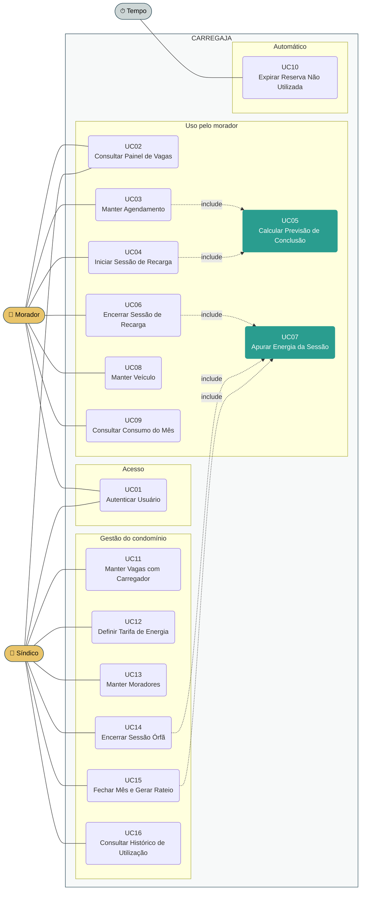
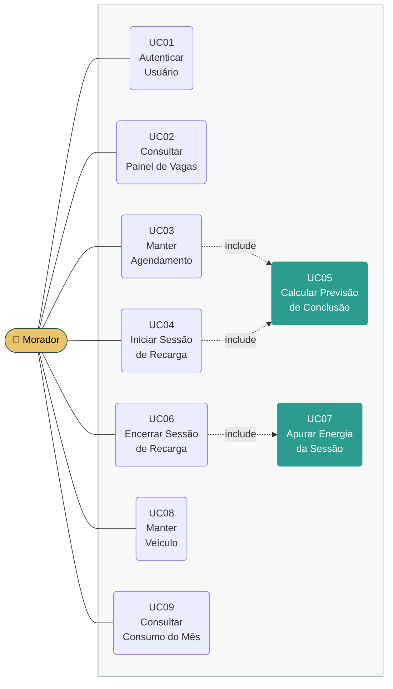
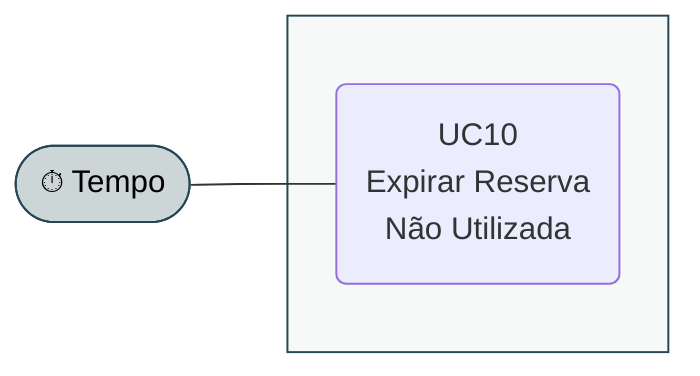

# Modelo de Caso de Uso

**CARREGAJA — Sistema de Agendamento e Rateio de Recarga de Veículos Elétricos em Condomínio**

Versão 2.0

## Histórico de Revisões

| Data | Versão | Descrição | Autor |
|---|---|---|---|
| 19/08/2026 | 1.0 | Elaboração inicial. Quatro atores, dezesseis casos de uso, matriz de permissões. Derivado do documento Visão v1.1. | Henrique de Almeida Marangoni Inacio |
| 27/08/2026 | 2.0 | **Reescrita integral por redução de escopo.** Dois atores, dezesseis casos de uso. Eliminados os perfis Estabelecimento, Operador de Caixa e Administrador do Sistema, o totem, o catálogo compartilhado de modelos e a gestão de assinantes. Incluídos o agendamento de vagas e o fechamento mensal com rateio. Derivado do documento Visão v2.0.<br><br>Revisão da própria v2.0 antes da aprovação: estado **Excedida** no painel (UC02), validação dos limites de agendamento em UC03, duração máxima da sessão em UC04, e distinção entre sessão órfã e excedida em UC14. Rastreabilidade atualizada para as seções 2.5 a 2.8 do Visão. | Henrique de Almeida Marangoni Inacio |

> **Situação deste artefato.** Os diagramas estão em **PlantUML** (`.puml`, fonte versionável)
> e em **Mermaid** (embutido neste documento). A transposição para o **Astah**, ferramenta
> indicada pelo processo SpinOff, está pendente — ver a seção *Pendências* ao final.

---

## 1. Atores

| Ator | Descrição | Autentica? |
|---|---|---|
| **Morador** | Condômino ou residente autorizado, proprietário de veículo elétrico. Vinculado a um apartamento, que é a unidade de rateio. Interage pela aplicação web no celular, tanto do apartamento quanto da garagem. | Sim |
| **Síndico** | Responsável pela administração do condomínio, eleito em assembleia, ou preposto da administradora. Configura o sistema, trata exceções e fecha o mês. | Sim |
| **Tempo** *(ator temporal)* | Ator não humano. Representa a passagem do tempo como disparo de comportamento do sistema — no caso, a expiração de reservas não utilizadas, que ocorre sem intervenção de usuário. | Não se aplica |

**Nota sobre a acumulação de perfis.** O síndico é também condômino e pode possuir veículo
elétrico. Nesse caso ele exerce os dois papéis, e suas recargas são apuradas e rateadas como as
dos demais. As ações de gestão ficam registradas com o usuário que as realizou.

---

## 2. Visão geral



> Os dois casos de uso destacados em verde — **UC05** e **UC07** — concentram a regra de
> negócio do sistema. São eles que devem ser atacados primeiro na fase de Elaboração, como
> arquitetura executável, conforme o risco RI-10 do documento Visão.

---

## 3. Casos de uso por ator

### 3.1. Morador



O morador é o usuário de maior volume do sistema. Seu ciclo típico tem duas interações
separadas no tempo: **de tarde, do apartamento**, ele consulta o painel e agenda (UC02, UC03);
**ao chegar à garagem**, registra o início (UC04) e, ao retirar o veículo, o encerramento
(UC06).

### 3.2. Síndico


A carga de uso do síndico é concentrada: a configuração (UC11 a UC13) ocorre na implantação e
raramente muda; o fechamento (UC15) é mensal; o tratamento de exceções (UC14) é eventual.

### 3.3. Tempo (ator temporal)



Único comportamento do sistema que não parte de uma ação de usuário. Existe porque a resposta
ao risco RI-05 do documento Visão — liberar automaticamente a vaga de quem reservou e não
compareceu — não pode depender de alguém se lembrar de fazê-lo.

---

## 4. Descrição dos casos de uso

As descrições abaixo são resumidas, conforme a boa prática indicada na tarefa *Definir o Escopo
do Sistema* do SpinOff. O detalhamento completo, com fluxos principal e alternativos, é
produzido na tarefa *Detalhar Requisitos*, na fase de Elaboração.

### UC01 — Autenticar Usuário

Identifica o usuário por credenciais e determina seu perfil — Morador, Síndico ou ambos. Todo
acesso ao sistema exige autenticação; não há uso anônimo (restrição RE-08 do documento Visão).
As credenciais são criadas pelo síndico ao cadastrar o morador (UC13).

### UC02 — Consultar Painel de Vagas

Exibe a situação de todas as vagas com carregador do condomínio, em um de quatro estados:

| Estado | Significado |
|---|---|
| **Livre** | Sem sessão ativa e sem reserva vigente. |
| **Reservada** | Há agendamento para a janela corrente ou futura. Exibe o horário da reserva. |
| **Ocupada** | Há sessão de recarga em andamento. Exibe a previsão de conclusão. |
| **Concluída, ainda ocupada** | A previsão de conclusão já passou e a sessão não foi encerrada. Sinaliza vaga que provavelmente pode ser liberada. |
| **Excedida** | A sessão ultrapassou a duração máxima (RE-11 do documento Visão). A sessão **permanece aberta** — o sistema sinaliza, não encerra. Alerta quem tem reserva na sequência de que a vaga pode não estar livre no horário. |

Os estados **Concluída, ainda ocupada** e **Excedida** são derivados do tempo decorrido, não de
uma ação de usuário. Nenhum dos dois altera o estado da sessão: existem para informar. É essa a
resposta possível ao risco RI-12 do documento Visão, dado que o sistema não controla o
carregador e, portanto, não pode liberar a vaga por conta própria.

Para o morador, o painel não identifica quem está usando cada vaga — apenas o estado e a
previsão. Para o síndico, apresenta adicionalmente o apartamento e o morador de cada sessão e
reserva, e destaca as sessões candidatas a órfãs (UC14).

### UC03 — Manter Agendamento

O morador reserva uma vaga com carregador para uma janela de horário futura, informando a vaga,
a data e o horário de início e fim. O sistema:

1. Valida que a vaga existe e está livre em toda a janela pedida — sem sobreposição com outra
   reserva nem com sessão em andamento cuja previsão avance sobre ela;
2. Valida os limites de agendamento (RE-12 do documento Visão): o morador **não pode ter outro
   agendamento futuro em aberto**, e a janela pedida deve começar dentro dos **próximos 7
   dias**;
3. Valida que a janela pedida não excede a **duração máxima de sessão** (RE-11), já que reservar
   mais tempo do que uma sessão pode durar bloquearia a vaga sem finalidade;
4. Calcula a previsão de conclusão (UC05) a partir do veículo cadastrado do morador e do nível
   de bateria informado, e a **exibe antes da confirmação**, para que a janela seja
   dimensionada pelo tempo efetivamente necessário — mitigação do risco RI-06;
5. Registra a reserva vinculada ao morador e ao apartamento.

Inclui também a **consulta aos próprios agendamentos** e o **cancelamento** de agendamento
ainda não iniciado, que libera a vaga imediatamente para os demais moradores e devolve ao
morador o direito de agendar novamente.

> **Por que o limite de um agendamento em aberto.** Com poucas vagas e muitos apartamentos, o
> agendamento por ordem de pedido favorece quem reserva primeiro. Limitando a um por morador,
> ninguém trava a agenda de vários dias, e o recurso circula — ver seção 2.6 do documento
> Visão. O limite é liberado assim que a reserva é usada, cancelada ou expirada (UC10).

### UC04 — Iniciar Sessão de Recarga

Ao chegar à garagem e plugar o veículo, o morador registra o início informando a vaga que
ocupou e o nível atual da bateria. Os dados do veículo — modelo, capacidade e potência máxima —
vêm do cadastro (UC08) e não são declarados a cada uso.

O sistema valida que a vaga existe e está disponível para aquele morador: **livre**, ou
**reservada por ele próprio** na janela corrente. Iniciar em vaga reservada por outro morador é
recusado. Calcula a previsão de conclusão (UC05), registra a sessão com data e hora de início e
a potência efetiva apurada, e marca a vaga como ocupada no painel.

Quando o início ocorre sobre reserva própria, a reserva é consumida pela sessão — o que devolve
ao morador o direito de fazer um novo agendamento (UC03).

A sessão fica sujeita à **duração máxima** (RE-11 do documento Visão) contada deste momento.
Atingido o limite, ela é sinalizada como excedida no painel (UC02), mas **não é encerrada**.

### UC05 — Calcular Previsão de Conclusão

Determina o horário previsto de conclusão da recarga a partir de:

```
potência efetiva  = min(potência do carregador da vaga, potência máxima do veículo)
energia a repor   = capacidade da bateria × (100% − nível informado)
tempo estimado    = energia a repor ÷ potência efetiva
```

A regra da **potência efetiva** é a razão de o cadastro de veículo existir: um carregador de
22 kW não recarrega mais rápido um veículo que aceita no máximo 6,6 kW.

É invocado em dois momentos com finalidades distintas: no **agendamento** (UC03), para
dimensionar a janela a reservar; e no **início da sessão** (UC04), para alimentar o painel com
a previsão de liberação que os demais moradores consultam.

### UC06 — Encerrar Sessão de Recarga

Ao retirar o veículo, o morador encerra a própria sessão. O sistema registra a data e hora de
encerramento, apura a energia da sessão (UC07), exibe ao morador a energia e o valor apurados —
permitindo contestação imediata, mitigação do risco RI-01 — e libera a vaga no painel.

O morador encerra **apenas as próprias sessões**. O encerramento de sessão alheia cabe somente
ao síndico, pela via administrativa do UC14.

### UC07 — Apurar Energia da Sessão

Calcula a energia atribuída à sessão e o valor correspondente:

```
duração          = encerramento − início
energia estimada = min(potência efetiva × duração, energia a repor)
valor da sessão  = energia estimada × tarifa por kWh vigente no início da sessão
```

Duas decisões de cálculo merecem registro:

**O limite pela energia a repor.** A energia estimada nunca excede o que faltava na bateria no
início. Sem esse limite, um veículo esquecido plugado acumularia consumo indefinidamente, e uma
sessão órfã produziria valor arbitrariamente alto. Com ele, a apuração converge para a carga
efetivamente possível.

**A tarifa vigente no início.** Considera-se a tarifa do momento em que a sessão começou, e não
a atual, para que uma alteração de tarifa durante a ocupação não altere o valor de uma sessão
já em curso.

> **Consequência aceita.** Como a energia é limitada pela carga que faltava, permanecer na vaga
> após a conclusão da recarga **não gera custo adicional**. O instrumento de rotatividade deste
> sistema é o agendamento, não o preço — ver o risco RI-04 do documento Visão.

### UC08 — Manter Veículo

O morador cadastra e mantém o próprio veículo: modelo, capacidade da bateria em kWh e potência
máxima de recarga em kW. O cadastro é feito **uma única vez** e reutilizado em todo agendamento
e toda sessão.

É esta decisão que dispensa o catálogo compartilhado de modelos da versão 1.0 deste modelo: com
poucas dezenas de moradores e um veículo por morador, manter um catálogo central custaria mais
do que o cadastro individual. O dado fica visível ao síndico, que pode conferi-lo contra o
documento do veículo — mitigação do risco RI-01.

### UC09 — Consultar Consumo do Mês

Apresenta ao morador suas sessões do período corrente, com data, vaga, duração, energia
estimada e valor, e o total acumulado que será lançado na sua cota condominial. Permite
consultar períodos anteriores já fechados.

Atende à necessidade de o morador **saber quanto será lançado antes de receber a cota** — seção
2.1 do documento Visão.

### UC10 — Expirar Reserva Não Utilizada

*Disparado pelo ator Tempo.* Decorrida a **tolerância de comparecimento** contada do início da
janela reservada sem que o morador tenha registrado o início da sessão (UC04), o sistema expira
a reserva e libera a vaga, que volta ao estado livre no painel.

A expiração fica registrada e é visível ao morador que reservou. É a resposta ao risco RI-05 do
documento Visão: sem ela, o agendamento — criado para organizar um recurso escasso — passaria a
desperdiçá-lo.

### UC11 — Manter Vagas com Carregador

O síndico cadastra e mantém as vagas com carregador da área comum: código de identificação da
vaga e potência do carregador em kW. A potência é insumo direto do cálculo de potência efetiva
(UC05).

Uma vaga não pode ser removida enquanto houver sessão em andamento ou reserva futura sobre ela;
pode ser **desativada**, o que impede novos agendamentos sem apagar o histórico já apurado.

### UC12 — Definir Tarifa de Energia

O síndico define o valor por quilowatt-hora aplicado no rateio, a partir da conta de luz da área
comum. O sistema mantém o **histórico das tarifas com suas datas de vigência**, uma vez que a
apuração de cada sessão usa a tarifa vigente no seu início (UC07).

### UC13 — Manter Moradores

O síndico cadastra e mantém os moradores com acesso ao sistema, vinculando cada um ao seu
apartamento e criando suas credenciais de acesso (UC01). O vínculo com o apartamento é o que
permite o rateio, já que a unidade de cobrança é a unidade autônoma, não a pessoa.

Um morador não pode ser removido enquanto tiver sessões no período ainda não fechado; pode ser
**desativado**, o que revoga o acesso preservando o histórico.

### UC14 — Encerrar Sessão Órfã

O síndico encerra administrativamente uma sessão que permanece aberta muito além da previsão de
conclusão, indicando que o veículo foi retirado sem encerramento no sistema. O sistema apura a
energia (UC07), libera a vaga e registra que o encerramento foi administrativo, com o síndico
responsável e o horário.

O registro da via administrativa importa: o valor apurado por essa via é o que o morador pode
contestar, e a rastreabilidade sustenta a resposta — resposta ao risco RI-03 do documento Visão.

**Sessão órfã e sessão excedida não são a mesma coisa.** A órfã é aquela cujo veículo já foi
retirado sem encerramento; a excedida (UC02) apenas ultrapassou a duração máxima e pode estar
legitimamente em uso. As duas chegam ao síndico pelo painel, mas exigem tratamentos opostos: a
órfã se resolve encerrando por aqui; a excedida se resolve junto ao morador, porque encerrá-la
liberaria no painel uma vaga que continua fisicamente ocupada. **Verificar qual é qual é ato
humano** — o sistema não distingue as duas, já que não detecta a presença do veículo (RE-05).

### UC15 — Fechar Mês e Gerar Rateio

O síndico consolida o período. O sistema apura todas as sessões encerradas do mês (UC07),
agrupa por apartamento e apresenta, para cada um, a energia total estimada e o valor devido,
além do total geral do condomínio.

O total geral permite ao síndico **confrontar a apuração com a conta de luz da área comum** —
mitigação do risco RI-07. Após o fechamento, o período não aceita novas sessões nem alterações,
e o resultado fica disponível para exportação, uma vez que o lançamento na cota ocorre fora do
sistema (restrição RE-10).

Sessões ainda abertas no momento do fechamento impedem a operação e devem ser tratadas antes,
por UC06 ou UC14.

### UC16 — Consultar Histórico de Utilização

Apresenta ao síndico a utilização das vagas por período: horas de ocupação por vaga, faixas de
horário de maior demanda, consumo por apartamento e agendamentos expirados por não
comparecimento.

Atende à necessidade de levar dados objetivos à assembleia ao propor a ampliação da estrutura —
seção 2.8 do documento Visão — e permite identificar padrão de reserva desproporcional,
mitigação do risco RI-06.

---

## 5. Matriz de permissões de acesso

| # | Caso de uso | Morador | Síndico | Tempo |
|---|---|:---:|:---:|:---:|
| UC01 | Autenticar Usuário | ✔ | ✔ | — |
| UC02 | Consultar Painel de Vagas | ✔ | ✔ | — |
| UC03 | Manter Agendamento | ✔ | — | — |
| UC04 | Iniciar Sessão de Recarga | ✔ | — | — |
| UC05 | Calcular Previsão de Conclusão | *incl.* | — | — |
| UC06 | Encerrar Sessão de Recarga | ✔ | — | — |
| UC07 | Apurar Energia da Sessão | *incl.* | *incl.* | — |
| UC08 | Manter Veículo | ✔ | — | — |
| UC09 | Consultar Consumo do Mês | ✔ | — | — |
| UC10 | Expirar Reserva Não Utilizada | — | — | ✔ |
| UC11 | Manter Vagas com Carregador | — | ✔ | — |
| UC12 | Definir Tarifa de Energia | — | ✔ | — |
| UC13 | Manter Moradores | — | ✔ | — |
| UC14 | Encerrar Sessão Órfã | — | ✔ | — |
| UC15 | Fechar Mês e Gerar Rateio | — | ✔ | — |
| UC16 | Consultar Histórico de Utilização | — | ✔ | — |

✔ ator executa · *incl.* executado por inclusão · — sem acesso

### Fronteiras que a matriz torna explícitas

| Fronteira | Por quê |
|---|---|
| O **Morador** não acessa UC11 a UC16 | Não define a tarifa que lhe será cobrada, não altera o cadastro de vagas nem acessa dados de outros apartamentos. |
| O **Morador** vê o painel sem identificação alheia (UC02) | Saber *quando* a vaga libera resolve o problema da seção 2.2 do Visão; saber *quem* a ocupa não acrescenta e expõe o vizinho. |
| O **Síndico** não acessa UC03, UC04 e UC06 | Não agenda nem opera sessão em nome de morador. Quando ele próprio recarrega, atua como Morador — perfil acumulado, não permissão do perfil Síndico. |
| O **Síndico** encerra sessão apenas por UC14 | A via administrativa é distinta da via do morador (UC06) porque exige registro do responsável, sustentando a contestação do valor apurado. |
| O **Morador** não acessa UC14 | Encerrar sessão de terceiro liberaria a vaga de outro morador e fixaria o valor apurado dele. |
| **UC07 não é executado diretamente** | A apuração nunca é acionada isoladamente: ocorre sempre no encerramento (UC06, UC14) ou no fechamento (UC15), para que todo valor apurado tenha um fato que o originou. |
| **UC10 não tem ator humano** | Liberar a vaga de quem não compareceu não pode depender de alguém se lembrar de fazê-lo — ver risco RI-05. |

---

## 6. Rastreabilidade com o documento Visão

Cada caso de uso responde a uma ou mais necessidades registradas na seção 2 do Visão (v2.0).

| Necessidade (Visão §2) | Caso de uso |
|---|---|
| §2.1 Apurar o consumo de cada apartamento no período | UC07, UC15 |
| §2.1 Definir a tarifa por quilowatt-hora do rateio | UC12 |
| §2.1 Acompanhar o consumo acumulado do mês | UC09 |
| §2.2 Ver quais vagas estão livres, reservadas e ocupadas | UC02 |
| §2.2 Ver a previsão de liberação das vagas ocupadas | UC02, UC05 |
| §2.2 Agendar uma vaga para uma janela de horário | UC03 |
| §2.3 Cadastrar o veículo com capacidade e potência máxima | UC08 |
| §2.3 Informar o nível de bateria ao iniciar a recarga | UC04 |
| §2.3 Ver a previsão de conclusão antes de confirmar o agendamento | UC03, UC05 |
| §2.4 Liberar a vaga automaticamente por não comparecimento | UC10 |
| §2.4 Cancelar o próprio agendamento | UC03 |
| §2.5 Limite máximo de duração para qualquer sessão | UC04, UC02 |
| §2.5 Ver no painel a sessão que excedeu o previsto ou o limite máximo | UC02 |
| §2.5 Identificar as sessões que ultrapassaram o limite máximo | UC02, UC14 |
| §2.6 Um único agendamento futuro em aberto por morador | UC03 |
| §2.6 Limite de antecedência para agendar | UC03 |
| §2.6 Consultar a distribuição das reservas entre os apartamentos | UC16 |
| §2.7 Identificar sessões abertas muito além do previsto | UC02, UC14 |
| §2.7 Registrar o encerramento administrativo | UC14 |
| §2.8 Consultar o histórico por vaga, apartamento e período | UC16 |

Casos de uso sem necessidade correspondente no Visão — decorrem de restrições, riscos ou da
mecânica interna do sistema:

| Caso de uso | Origem |
|---|---|
| UC01 Autenticar Usuário | Restrição RE-08 (uso identificado, sem anonimato) |
| UC06 Encerrar Sessão de Recarga | Contrapartida necessária de UC04: sem encerramento não há duração, e sem duração não há apuração |
| UC11 Manter Vagas com Carregador | Pré-condição de UC02 e insumo da potência efetiva em UC05 |
| UC13 Manter Moradores | Pré-condição de UC01 e do vínculo apartamento–consumo que viabiliza o rateio |

---

## 7. Fora do escopo

Registrado para evitar ambiguidade na leitura do modelo. Todos decorrem de restrições do
documento Visão v2.0.

| Não é caso de uso deste sistema | Restrição |
|---|---|
| Acionar, bloquear ou medir o carregador | RE-05 |
| Processar pagamento ou emitir cobrança | RE-06 |
| Cadastrar ou gerenciar outros condomínios | RE-07 |
| Uso anônimo, sem cadastro | RE-08 |
| Medir a energia efetivamente consumida | RE-09 |
| Lançar o valor na cota condominial | RE-10 |

### Removido em relação à versão 1.0 deste modelo

O quadro abaixo registra o que deixou de existir com a redução de escopo, para que a leitura
das duas versões não gere dúvida sobre omissão involuntária.

| Elemento da v1.0 | Situação na v2.0 |
|---|---|
| Atores Estabelecimento, Operador de Caixa e Administrador do Sistema | Removidos. Gestão concentrada no Síndico. |
| Totem de autoatendimento | Removido. Canal único: aplicação web no celular do morador. |
| Encerramento no ponto de pagamento | Removido. O morador encerra a própria sessão (UC06). |
| Código de sessão e comprovantes de início e encerramento | Removidos. O uso é identificado por login, dispensando código de portador. |
| Catálogo compartilhado de modelos e perfis genéricos | Removido. Substituído pelo cadastro individual de veículo (UC08). |
| Manter Estabelecimentos Assinantes | Removido. Instalação única (RE-07). |
| Cobrança por tempo de ocupação | Substituída por apuração de energia estimada (UC07). |
| — | **Incluído:** agendamento de vagas (UC03), expiração por não comparecimento (UC10) e fechamento mensal com rateio (UC15). |

---

## 8. Pendências

| Pendência | Impacto |
|---|---|
| **Transposição para o Astah.** O SpinOff indica o Astah para modelagem UML e fornece o `Template - Modelos Analise e Design.asta`. Os diagramas aqui estão em PlantUML e Mermaid. | O item 7 do Checklist de Projeto pergunta se o artefato foi criado com o template atual — só será plenamente atendido após a transposição. |
| **Definição da tolerância de comparecimento.** O valor do prazo de UC10 ainda não foi fixado. | Parâmetro de configuração; não bloqueia o modelo, mas precisa ser decidido antes do detalhamento de UC10. |
| **Aprovação do escopo reduzido pelo Product Owner.** | Item 11 do Checklist de Projeto. A redução de escopo torna a aprovação mais relevante, por alterar o produto acordado. |
| **Protótipo das telas do morador.** Não iniciado. | Item 10 do Checklist de Projeto (condicional: *"caso tenha sido criado"*). |

---

## 9. Referências

| Documento | Local |
|---|---|
| CARREGAJA - Visão (v2.0) | `1.Requisitos/` |
| Diagrama geral em PlantUML | `2.Analise e Design/CARREGAJA - Modelo de Caso de Uso.puml` |
| Diagramas por ator em PlantUML | `2.Analise e Design/CARREGAJA - Modelo de Caso de Uso - por ator.puml` |
| Guia - Use Case e Histórias do Usuário | `.spinoff/guias/` |
| SpinOff — tarefa *Definir o Escopo do Sistema* | `.spinoff/METODO.md` |
